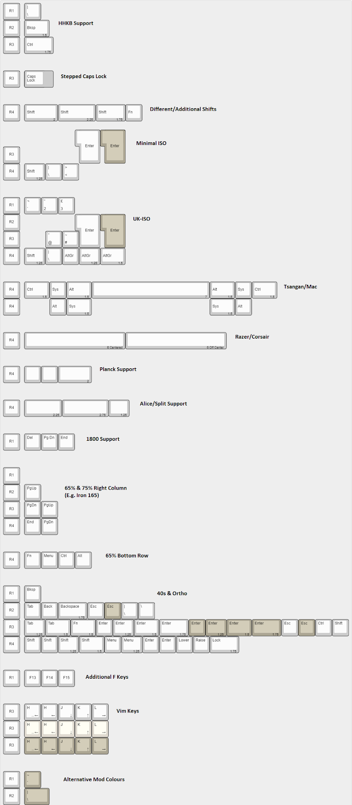
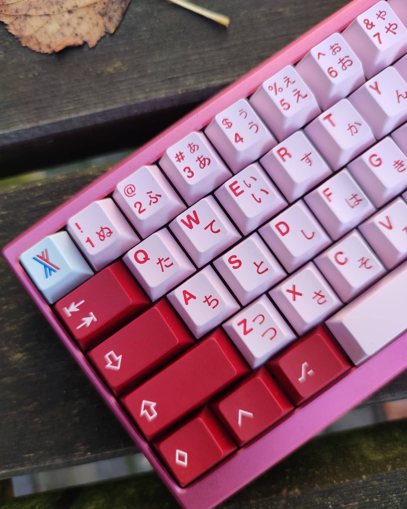
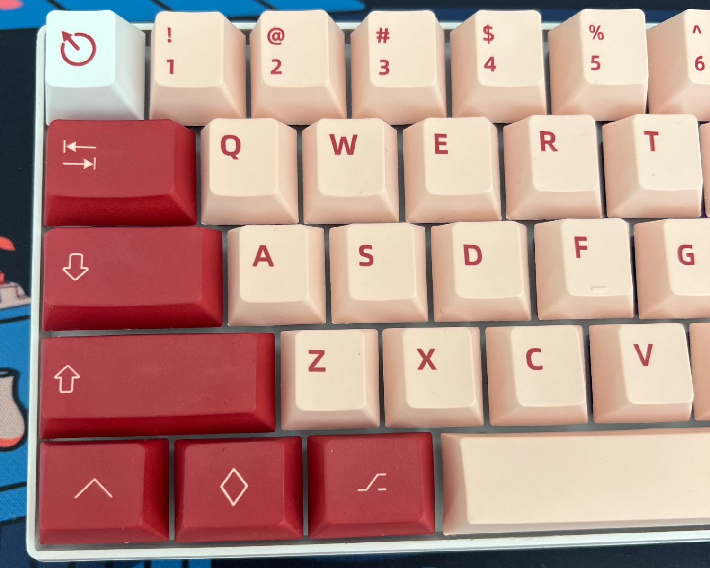
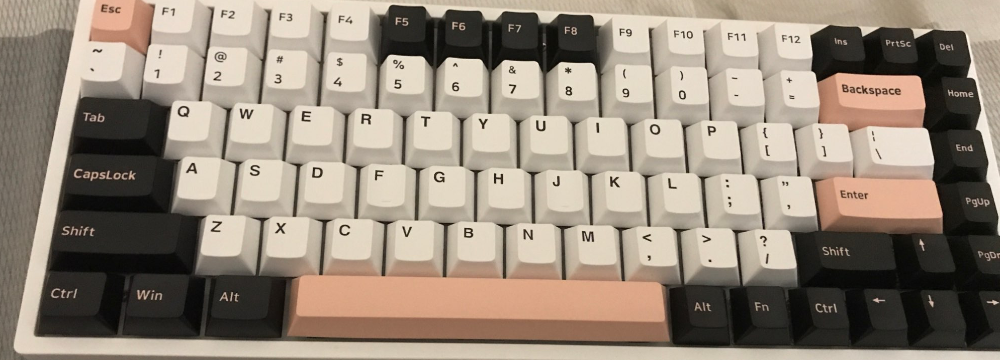

# Keycaps

- [Keycaps](#keycaps)
  - [Switch orientation on PCB and keycap interference](#switch-orientation-on-pcb-and-keycap-interference)
  - [On Clones](#on-clones)
  - [On Kitting, or, How To Read A Kitting Diagram](#on-kitting-or-how-to-read-a-kitting-diagram)
    - [Extensions To Look For](#extensions-to-look-for)
    - [Example: A Well Kitted Keyset](#example-a-well-kitted-keyset)
  - [How To Find A Bad Keycap Set](#how-to-find-a-bad-keycap-set)
    - [Reading Reviews](#reading-reviews)
    - [Poor Legends Quality](#poor-legends-quality)
      - [Poor Printing](#poor-printing)
      - [Poor alignment](#poor-alignment)
      - [Mold quality](#mold-quality)
    - [Poor kitting/compatability](#poor-kittingcompatability)
    - [Warped Bars](#warped-bars)
    - [Thickness](#thickness)

## Switch orientation on PCB and keycap interference

Please consult [this section](WILL_THIS_WORK_TOGETHER.md/#north-facing-keycap-interference) when thinking on if your keycaps may have any issue with the switches in your PCB.

## On Clones

If you're reading this guide, there's a solid chance that you're new, and are not emotionally ready to pony up $130 for a best-in-class keyset from a group buy. Instead, you're looking to spend a more reasonable amount of money within a price bracket that is saturated by clones. Clones aren't the only option, but sometimes, they are hard to ignore.

The morals of intellectual property theft (Can you steal color combinations? How bad is it for you personally to buy keys printed with stolen art?) are a question best left for yourself to answer - we’re not interested in moral philosophy here. However, here are the possible functional issues with buying clones:

- Poor color matching
- Poor quality molds for doubleshot
- Poor quality print for legends
- Poor quality legends alignment
- Error prone to dye-sub misprint and otherwise poor quality control
  - Getting a replacement key (if its even offered) for a misprint may take 1-2 months
- Sub-standard thinness

## On Kitting, or, How To Read A Kitting Diagram

Pictured: 108 key keyset, via [Amazon](https://www.amazon.ca/Japanese-Keycaps-Percent-Mechanical-Keyboard/dp/B0936TN1JJ)

The above keyset will provide support for standard 60% (ex. Pok3r) ANSI (this means **not ISO**, this means **not European** usually) layouts, ANSI TKL’s, and ANSI full-size keyboards. However, what are you to do if you have a board you want to put keycaps on that even deviates slightly from this? You’ll be out of luck without the proper 1.75u right shift that you might need, or the 1u Control/Function/Alt keys that you need.

The real question that you’re asking is: “How do I know what I need?” For keyboards that have a less-common layout (i.e. not 6.25u spacebar 60%, TKL, or full-size), the reading below will attempt to explain what you need to look for to support your own board in diagrams of keysets.

### Extensions To Look For

If you know your board layout, then you can see which individual keys you need so you can hunt for them in the kitting diagrams provided with every keyset. This chart is wholesale stolen from [the excellent KDD Info & How-To guide written by Buburoo](https://docs.google.com/document/d/1jjQghqjGP6BasZt4i0zTmK4p-gN_3IRhIAm2-CPE0kE/edit#).

Note: the piece on "different/additional shifts" denotes

- 2u shift support for GK64 and Womier K66/YC66 support
- 2.25u shift support for Leopold FC660-type layouts
- 1.75u shift support for most 65%, 75%, 96%/1800, and split right shift layouts

Now with this information known to you, you can probably start reading kitting renders for support like I have in this diagram below -

Pictured: JKDK RoW (Red-on-white), annotations by me

### Example: A Well Kitted Keyset

Pictured: “Cherry Taro”, designed by pwade (via [Novelkeys](https://novelkeys.com/products/cherry-taro)), annotations by me

Here’s a good example of a base kit that provides very flexible kitting! You may not use all of it, but you’ll likely be able to use it on most/all of your boards, barring those with unpopular and esoteric layouts. You get

- Mod pipe and mod tilde (some prefer their look on 60’s)
- F13 key (nice for F13 TKL's or some exploded 75%'s)
- Stepped caps lock and 1.75u Control on R3 (nice to have for HHKB-style layouts)
- Physical ISO compatibility (ISO enter, R3 1u pipe, 1.25u left shift R4, and >< key beside left shift)
- Flexible 65%, 75%, and 1800/96% support
- Split backspace (R2 1.5u backspace, R1 pipe)
- Split bars (predominantly for Alice-layout spacebars support, may support other less-common layouts as well)
- 6u spacebar for stranger layouts
- Minivan (popular 40% layout) (R2 1.75u backspace, R3 1.25u Tab and 1.5u Enter)
- Extra shift keys
  - 2.25u right shift to support FC660M-style layouts
  - 2u shift to support GK64-like layouts with 2u left shift and arrows or Womier K66/YC66 2u right shift
  - 1u shift to support right shift on GK64-like layouts

## How To Find A Bad Keycap Set

### Reading Reviews

Reading reviews from people who have actually purchased a keyset is more advisable than asking someone who has never bought the keyset you’re about to purchase. Reviews provide some context towards the quality of a product, and the high chance that users have submitted photos of what their keyset looks like on arrival. Don’t get caught by renderbait! Yes, a cell phone camera shot plus your gaming monitor probably won't reproduce accurate colors, blah blah blah, but come on, it's better than going off of the renders from a vendor.

### Poor Legends Quality

#### Poor Printing

| Genuine GMK Darling                                                                                                                                     | PBT Darling Clone Example 1                         | PBT Darling Clone Example 2                              |
| ------------------------------------------------------------------------------------------------------------------------------------------------------- | --------------------------------------------------- | -------------------------------------------------------- |
|                                                                                                                    |  |       |
| via [MyKeyboard.eu](https://www.facebook.com/mykeyboard.eu/posts/gmk-darling-by-xerpocalypse-is-here-and-it-starts-shipping-out-today/2796713847241440) | Poor color matching and different legends font.     | Poor color matching, different font, missing sublegends. |

| [ePBT Dreamscape Render](https://geekhack.org/index.php?topic=113377.0) | HK Gaming Dreamscape                                                                                                                |
| ----------------------------------------------------------------------- | ----------------------------------------------------------------------------------------------------------------------------------- |
|                     |                                                                |
| Designed by tsoiab10                                                    | Left side of the gradient does not have white legends like the original set, implying HK Gaming cannot/will not do reverse dye sub. |

#### Poor alignment

| JKDK BoW (black on white)                                                                | SRP Pseudo-Handarbeige                                           |
| ---------------------------------------------------------------------------------------- | ---------------------------------------------------------------- |
|  |  |
| via JKDK message to cardio (“That shift is flying away”)                                 | Sinking Tab and Pipe legend, short backslash legend vs pipe      |

#### Mold quality

| Winmix/Catcher Olivia clone, doubleshot PBT                                                                                                                                                         | "Shell Studio" "PBT Blush" (Doubleshot PBT Olivia clone)                                                                                                                                                       |
| --------------------------------------------------------------------------------------------------------------------------------------------------------------------------------------------------- | -------------------------------------------------------------------------------------------------------------------------------------------------------------------------------------------------------------- |
|                                                                                                                                  |                                                                                                                                          |
| via AliExpress reviews. Lack of icon legends on the modifier keys are a dead giveaway to this being a clone. I'm personally not a fan of the font used. Also, what’s the deal with “CapsLock”, man? | From [imgur album](https://imgur.com/a/CufPcmV) provided by /u/RatratanX from Reddit. Via their description, “You'll get what you paid for. Uneven thickness of legends. Still lucky no problems on mounting.” |

| Winmix OSA Doubleshot PBT                                                              | Aifei clone of GMK Jamon                                                        | Domikey Dolch (Cherry profile)                                                                                                   |
| -------------------------------------------------------------------------------------- | ------------------------------------------------------------------------------- | -------------------------------------------------------------------------------------------------------------------------------- |
|                                         |                    |                                                                       |
| via /u/denker88 on reddit. Legends are fine with the exception of one prominent issue. | via AliExpress review. Note the inconsistent letter sizes on the modifier keys. | Decent legend quality, but someone with a very fussy eye might make a stink about the spacing between the “F” and “T” in “Shift” |

### Poor kitting/compatability

Please refer to [the kitting section](#on-kitting-or-how-to-read-a-kitting-diagram) for more detail, but a bad keyset is one that is going to omit support for boards you either have currently, or plan on having in the future.

### Warped Bars

Early ePBT sets and Geekark R1 were known to have bars for stabilized keys that were significantly warped, and required intervention to un-warp them. These things have been solved, but some cheaper PBT sets with bars that don’t have rigidity ribs may warp as the injected plastic cools, and might require a dip in very hot water to soften it up enough for you to un-warp them. NOTE: DO NOT ATTEMPT THIS WITH ABS, YOU WILL MELT YOUR KEYCAPS.

### Thickness

TODO: Fill this out
