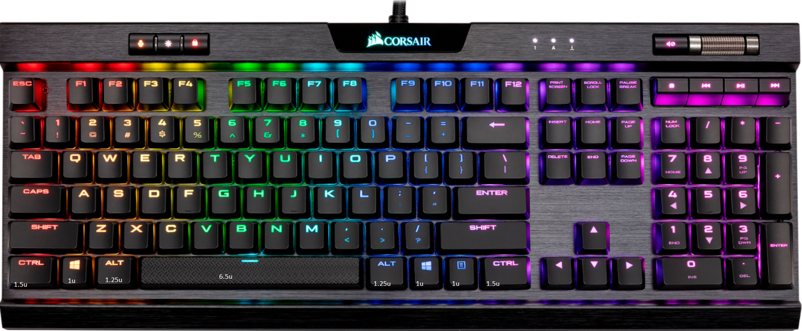

# Prebuilt Keyboards

- [Prebuilt Keyboards](#prebuilt-keyboards)
  - [Non-standard bottom row layouts](#non-standard-bottom-row-layouts)

Believe it or not, you may not require something as robust as whatever build that some Keyboard YouTuber is showing off with a $700 price tag in the preview thumbnail! A healthy mindset recognizes that a keyboard is a tool, and either your tool works for you, or works against you; a good prebuilt board will work for you, and get everything you need without getting in your way.
Things to keep in mind:

- The Good Brands
  - Some brands are preferred by the MechKeys server than others. Leopold is known to have binned (cherry-picked) Cherry MX switches. Them, Varmilo and Keychron are known to apply some grease on their stabilizer wires to prevent stabilizer rattle. ABKO makes tanks, and so on.
- Plate mounted stabilizer limitations
  - Most prebuilts have their PCBs wave-soldered together, which is a process too hot for most PCB mounted stabilizers to survive; hence, most prebuilts are built with plate mount stabilizers. They will generally be unable to be upgraded with other PCB mount stabilizers.
- Factory lube on stabilizers
  - Some gamery prebuilts will probably lack this, since stabilizer wire rattle is part of the fun! Other manufacturers (Leopold, Varmilo, Keychron) will have some sort of grease applied to the stabilizer wires on your boards and reduce rattle. If you don’t intend on injecting your stabilizer housings with Superlube, this is nice to have!
- Non-Standard Bottom row layouts (ex. 6.5u spacebar on some Corsair layouts)
  - Non-standard bottom row layouts can make finding compatible keysets between a little tricky (ex. Womier K66) to nightmarish (Corsair K70).
- Non-Cherry MX switches
  - Common switch manufacturers you’ll find in prebuilts are Gateron, Kailh, Outemu, and maybe TTC in a few cases. Most are decent and punch above their weight comapred to Cherry cost. Sure, they'll have some amount of scratch and spring ping stock
  - Supposedly HyperX is just rebranded Gateron, Keychron branded switches are just rebranded Huano’s (not great), Logitech’s GL’s are Kailh Chocs, Logitech GX are just Kailh.
  - Omron Romer-G: unpopular switch, tactility is unimpressive
  - More information about the switch manufacturer meta [here](#switches-the-switch-meta)
- Hotswap support is not found on many prebuilts, but when it’s found, it’s nice to have!
  - See [this section](KITS.md/#hotswap-support) for more detail

## Non-standard bottom row layouts

Some bottom row layouts on *some* prebuilts will have strange width spacebars that are less easy to find replacements for than your traditional 6.25u or 7u spacebar.

Pictured above: Corsair K70, via [Best Buy](https://www.bestbuy.com/site/corsair-k70-rgb-mk-2-low-profile-rapidfire-full-size-wired-mechanical-cherry-mx-low-profile-speed-switch-gaming-keyboard-black/6298657.p?).
Note the 6.5u spacebar.

Pictured above: Razer Blackwidow Chroma v1, via [Razer](https://www2.razer.com/br-pt/gaming-keyboards-keypads/razer-blackwidow-chroma-v1).
Note the 6u spacebar.
