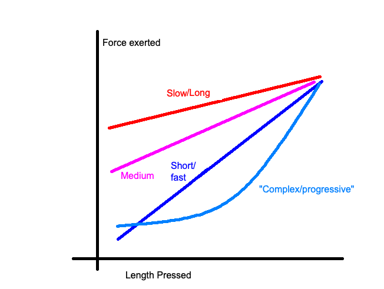

# Springs

## Do I need to replace mine?

Probably not! Unless they're too heavy or too light, in which case, fill your boots. If your springs are crunchy or pingy, just lube them with your preferred method (painting with grease, coating in oil in a bag, donut dipping, etc) and call it a day.

## What do lengths mean?

For springs with a linear spring curve (as you can assume by default), you can consider Hooke's law, which is

`F = -kx`

where `F` is the spring force, `k` is the spring constant (the slope of a force curve), and `x` is the length of compression.

A switch at rest will have the spring compressed more-or-less down to the same length; therefore, a longer spring will be compressed more at rest within a switch to reach that distance, and thus feel heavier at the top. Likewise, a shorter spring will feel much lighter at the top than other springs with a comparable bottom-out weight, as it did not need to be compressed that far.

## What are slow/complex/progressive springs?

* Slow: longer springs imply a spring curve with a reduced slope; i.e., the force exerted changing across the press changes `slow`er than a spring of a normal (medium) 15mm length.
* Complex/Progressive: Springs that do not have a linear force curve; they start lighter at the top, and grow heavier on the press faster
* Two/three stage: Very very long springs, generally around 22mm in length. In my experience, these just feel like more slow springs, and don't vary much in feeling across the press.

### Snake oil

[You should be very skeptical of "progressive" springs](https://geekhack.org/index.php?topic=112430.0) is a great post provided by Pylon on why springs marketed as "progressive" might be overselling their purported effects. In short, they are more linear in force curve than they may be marketed as.

## How do they sound?

Longer the spring, louder the top-out (stem hitting the top housing on the press return). Heavier the spring, louder the top out.

## What should I avoid?

* Some community members do not recommend buying Spring springs, not because they are bad, but because they have a history of scamming customers (not fulfiling orders) in the past.
* Rumors get thrown around from time to time about the gold off gold-plated springs flaking off after some number of years. YMMV.
